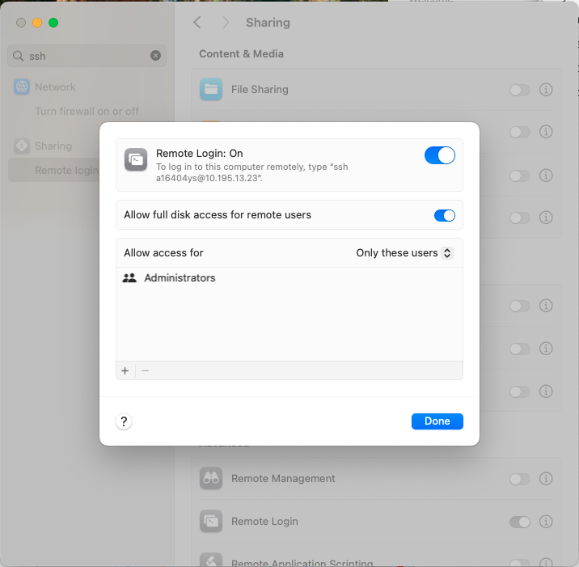

# sync-obs
Simple sync script for syncing raw files from observation sites to a remote server. This script will sync data from Pi to a remote `destination`  and move it to the `archive_dir` (after 5 min) as daily ZIP files 

``` 
git clone https://github.com/willmorrison1/sync-obs
cd sync-obs
chmod u+rwx *
nano sync_config.json
sudo ./install_service.sh
```

# `sync_config.json`

## example


``` json
{
    "source": "/home/smurobs/FTP/CL61/",
    "destination": "datagate5@gateway.meteo.uni-freiburg.de:/data/CL61/T3250605/",
    "_archive_dir": "/home/smurobs/archive/",
    "delete_empty_dirs": true,
    "archive_older_than_mins": 5,
    "archive_max_fill_fraction": 0.48,
    "sync_repeat_time_mins": 5,
    "rsync_opts": "rsync -vv -e 'ssh -oBatchMode=yes' -rt -l -D --compress --compress-level=7 --append-verify --update --no-owner --no-group --no-perms --chmod=ugo=rwX --mkpath"
}

```


## verify

If it prints the JSON without an error, the syntax is valid. 

```bash
python3 -m json.tool sync_config.json
```


## Test destination using a MacBook

```bash
ssh-keygen -t ed25519 -f ~/.ssh/id_pi1

# then copy the public key to the MacBook
cd .ssh
touch id_pi1

# add the key to Pi's authorized_keys
cat ~/.ssh/id_pi1.pub | ssh a16404ys@10.195.13.23 'mkdir -p ~/.ssh && chmod 700 ~/.ssh && cat >>~/.ssh/authorized_keys'
# it will ask password to login Macbook

# then test 
ssh -i ~/.ssh/id_pi1 -o IdentitiesOnly=yes a16404ys@10.195.12.23
```

- the 10.196.13.23 is dynamic. 



## Test the sync from the command line

```bash
rsync -e 'ssh -i /home/yuansun/.ssh/id_pi1 -o IdentitiesOnly=yes -o BatchMode=yes' \
-rt -l -D \
--compress --compress-level=7 \
--append-verify --update \
--no-owner --no-group --no-perms \
--chmod=ugo=rwX \
/home/yuansun/FTP/CL31/test_sync.txt \
a16404ys@10.195.13.23:/Users/a16404ys/Desktop/data/
```

## Set archive path

```bash
# create an archive directory
sudo mkdir -p /mnt/smurobs_ssd/archive
# add permission
sudo chown yuansun:yuansun /mnt/smurobs_ssd/archive 
```


# sync-obs logic

With reference to the `sync_config.json` keys: 

- Files in the `source` are transferred to the `destination` every `sync_repeat_time_mins` minutes using the `rsync_opts` command.

- Files in `source` last modified more than `archive_older_than_mins` minutes ago are zipped and moved to `_archive_dir`.

- When the `_archive_dir` volume is more than `archive_max_fill_fraction` full, the oldest zip file is removed.

- When the `_archive_dir` is missing, files are archived in a directory on the same level as the `source` directory.

- The contents of sync_config.json are evaluated after each `sync_repeat_time_mins`: no need to restart the script if you modify sync_config.json


# Check is running

```bash
# restart service after modification
sudo systemctl restart sync_obs.service

# run the service
systemctl status sync_obs.service
```
and/or
```bash
# check Python program's output
journalctl -u sync_obs.service
```

